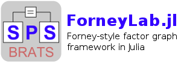

ForneyLab.jl overview
=====================

The *ForneyLab* package provides a framework for working with `Forney-style factor graphs <http://www.crm.sns.it/media/course/1524/Loeliger_A.pdf>`_ (FFGs). A FFG is a probabilistical graphical model that is particularly well suited for modeling signal processing systems. ForneyLab.jl provides the following:

- Tools and data structures for building FFGs;
- A built-in collection of commonly used factor nodes;
- Functions to automatically generate (message passing) algorithms to perform inference in FFGs;
- An engine to efficiently run message passing algorithms on FFGs.

The reader is assumed to be familiar with Forney-style factor graphs and message passing algorithms on these types of graphs.

**Contents:**

.. toctree::
   :maxdepth: 1

   introduction
   graphical_model
   nodes
   diagnostics_and_reporting

.. Indices and tables
.. ==================

.. * :ref:`genindex`
.. * :ref:`modindex`
.. * :ref:`search`
