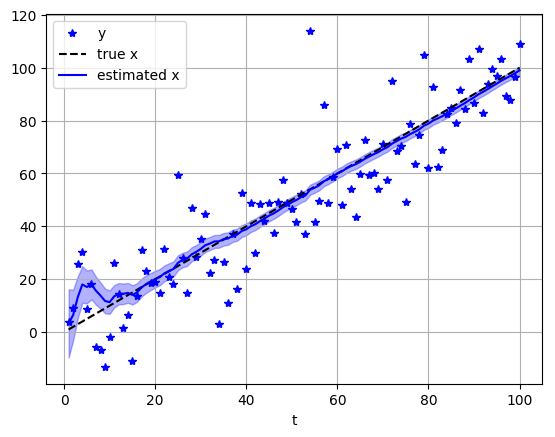

# State Estimation in a State-space Model (Forward Only)

In this demo, the goal is to filter noisy observations by performing on-line inference with a state-space model (SSM).

We wil use the following model:

\begin{align*}
    u &= 1; v = 200;\\
    n_t &\sim \mathcal{N}(0, v)\\
    x_t &= x_{t-1} + u\\
    y_t &= x_t + n_t
\end{align*}

In this model, we denote by `x_t` the current state of the system (at time step `t`), by `x_t_min` the previous state at time `t-1`, `u` is a constant system input and `y_t` is a noisy observation of `x_t`. We further assume that the observations are corrupted by i.i.d. Gaussian noise with variance `v`. 

The SSM can be represented by the following Forney-style factor graph, where the pictured section is chained over time:

```
                 (u)
                  |
    (x_t_min) --> + --> = --> (x_t)
                        |    
               (n_t)--> +
                        |
                      (y_t)
```

For on-line (forward-only) estimation in ForneyLab, it suffices to build a single-time-step section of the model. We then iteratively infer the posterior statistics by considering one observation at a time. After each inference step, we pass the posterior statistics on as the new prior statistics, leading to an (exact) on-line filtering algorithm that is equivalent to Kalman filtering.

We start by generating some data, and then showcase the ForneyLab functionality by walking through the model specification, algorithm generation and execution steps.


```julia
# Data
n_samples = 100
x = [t for t=1:n_samples] # True state
y = x + sqrt(200.0)*randn(n_samples); # Noisy observations of state
```

# Build the Model

In the model specification phase we define (one time-section of) the generative model. ForneyLab allows for a distributed-as notation `~`, which declares a probabilistic relation between variables. Also the `+` and `*` operators accept variables as arguments, and impose an addition/multiplication constraint on their arguments.


```julia
using ForneyLab

g = FactorGraph()

# declare priors as random variables
@RV m_x_t_min # m_x_t_min = Variable(id=:m_x_t_min)
@RV v_x_t_min # v_x_t_min = Variable(id=:v_x_t_min)
@RV x_t_min ~ GaussianMeanVariance(m_x_t_min, v_x_t_min)

# System equations
# u = 1.0; v = 200.0
@RV n_t ~ GaussianMeanVariance(0.0, 200.0)
@RV x_t = x_t_min + 1.0
@RV y_t = x_t + n_t

# Name variable for ease of lookup
#x_t.id = :x_t;
```

In a simulation, we will want to feed the variable `y_t` with data. Also, we will want to feed the "priors" with the posteriors from the previous time step. We will use a `placeholder()` function to indicate that its argument variable will be clamped to data before the inference procedure.


```julia
# Placeholders for prior
placeholder(m_x_t_min, :m_x_t_min) # placeholder(:m_x_t_min) does not work
placeholder(v_x_t_min, :v_x_t_min)

# Placeholder for data
placeholder(y_t, :y_t);
```

ForneyLab offers a `draw()` function that visualizes the factor graph.


```julia
ForneyLab.draw(g)
```


<?xml version="1.0" encoding="UTF-8" standalone="no"?>
<!DOCTYPE svg PUBLIC "-//W3C//DTD SVG 1.1//EN"
 "http://www.w3.org/Graphics/SVG/1.1/DTD/svg11.dtd">
<!-- Generated by graphviz version 2.40.1 (20161225.0304)
 -->
<!-- Title: G Pages: 1 -->
<svg width="954pt" height="410pt"
 viewBox="0.00 0.00 953.99 410.00" xmlns="http://www.w3.org/2000/svg" xmlns:xlink="http://www.w3.org/1999/xlink">
<g id="graph0" class="graph" transform="scale(1 1) rotate(0) translate(4 406)">
<title>G</title>
<polygon fill="#ffffff" stroke="transparent" points="-4,4 -4,-406 949.9893,-406 949.9893,4 -4,4"/>
<!-- 11572937723887850956 -->
<g id="node1" class="node">
<title>11572937723887850956</title>
<polygon fill="none" stroke="#000000" points="598.9893,-188 526.9893,-188 526.9893,-116 598.9893,-116 598.9893,-188"/>
<text text-anchor="middle" x="562.9893" y="-153.8" font-family="Times,serif" font-size="9.00" fill="#000000">+</text>
<text text-anchor="middle" x="562.9893" y="-144.8" font-family="Times,serif" font-size="9.00" fill="#000000">addition_1</text>
</g>
<!-- 13433346675606599163 -->
<g id="node4" class="node">
<title>13433346675606599163</title>
<polygon fill="none" stroke="#000000" points="322.9497,-72 217.0288,-72 217.0288,0 322.9497,0 322.9497,-72"/>
<text text-anchor="middle" x="269.9893" y="-40.095" font-family="Times,serif" font-size="9.00" fill="#000000">𝒩</text>
<text text-anchor="middle" x="269.9893" y="-26.505" font-family="Times,serif" font-size="9.00" fill="#000000">gaussianmeanvariance_1</text>
</g>
<!-- 11572937723887850956&#45;&#45;13433346675606599163 -->
<g id="edge4" class="edge">
<title>11572937723887850956&#45;&#45;13433346675606599163</title>
<path fill="none" stroke="#000000" d="M526.7678,-137.6598C475.6291,-117.4137 381.9377,-80.3209 322.9738,-56.9768"/>
<text text-anchor="start" x="425.9893" y="-91.6" font-family="Times,serif" font-size="8.00" fill="#ff0000">x_t_min</text>
<text text-anchor="start" x="322.9738" y="-58.5768" font-family="Times,serif" font-size="8.00" fill="#000000">1 out </text>
<text text-anchor="start" x="508.5452" y="-139.2598" font-family="Times,serif" font-size="8.00" fill="#000000">2 in1 </text>
</g>
<!-- 9405312733446738861 -->
<g id="node5" class="node">
<title>9405312733446738861</title>
<polygon fill="#d3d3d3" stroke="#000000" points="598.9893,-63 544.9893,-63 544.9893,-9 598.9893,-9 598.9893,-63"/>
<text text-anchor="middle" x="571.9893" y="-33.3" font-family="Times,serif" font-size="9.00" fill="#000000">clamp_3</text>
</g>
<!-- 11572937723887850956&#45;&#45;9405312733446738861 -->
<g id="edge6" class="edge">
<title>11572937723887850956&#45;&#45;9405312733446738861</title>
<path fill="none" stroke="#000000" d="M565.7876,-115.9327C567.1086,-98.9067 568.659,-78.9235 569.8792,-63.1968"/>
<text text-anchor="start" x="567.9893" y="-91.6" font-family="Times,serif" font-size="8.00" fill="#ff0000">clamp_3</text>
<text text-anchor="start" x="551.6565" y="-64.7968" font-family="Times,serif" font-size="8.00" fill="#000000">1 out </text>
<text text-anchor="start" x="547.5649" y="-109.5327" font-family="Times,serif" font-size="8.00" fill="#000000">3 in2 </text>
</g>
<!-- 2225022265542577992 -->
<g id="node2" class="node">
<title>2225022265542577992</title>
<polygon fill="none" stroke="#000000" points="819.9497,-188 714.0288,-188 714.0288,-116 819.9497,-116 819.9497,-188"/>
<text text-anchor="middle" x="766.9893" y="-156.095" font-family="Times,serif" font-size="9.00" fill="#000000">𝒩</text>
<text text-anchor="middle" x="766.9893" y="-142.505" font-family="Times,serif" font-size="9.00" fill="#000000">gaussianmeanvariance_2</text>
</g>
<!-- 7804868072012257112 -->
<g id="node3" class="node">
<title>7804868072012257112</title>
<polygon fill="#d3d3d3" stroke="#000000" points="776.9893,-63 722.9893,-63 722.9893,-9 776.9893,-9 776.9893,-63"/>
<text text-anchor="middle" x="749.9893" y="-33.3" font-family="Times,serif" font-size="9.00" fill="#000000">clamp_1</text>
</g>
<!-- 2225022265542577992&#45;&#45;7804868072012257112 -->
<g id="edge8" class="edge">
<title>2225022265542577992&#45;&#45;7804868072012257112</title>
<path fill="none" stroke="#000000" d="M752.7435,-115.8247C750.9608,-109.9491 749.4217,-103.8663 748.4424,-98 746.5453,-86.6363 746.5043,-73.9407 747.0992,-63.0118"/>
<text text-anchor="start" x="748.9893" y="-91.6" font-family="Times,serif" font-size="8.00" fill="#ff0000">clamp_1</text>
<text text-anchor="start" x="728.8765" y="-64.6118" font-family="Times,serif" font-size="8.00" fill="#000000">1 out </text>
<text text-anchor="start" x="738.5208" y="-109.4247" font-family="Times,serif" font-size="8.00" fill="#000000">2 m </text>
</g>
<!-- 17695905722520344607 -->
<g id="node8" class="node">
<title>17695905722520344607</title>
<polygon fill="#d3d3d3" stroke="#000000" points="945.9893,-63 891.9893,-63 891.9893,-9 945.9893,-9 945.9893,-63"/>
<text text-anchor="middle" x="918.9893" y="-33.3" font-family="Times,serif" font-size="9.00" fill="#000000">clamp_2</text>
</g>
<!-- 2225022265542577992&#45;&#45;17695905722520344607 -->
<g id="edge2" class="edge">
<title>2225022265542577992&#45;&#45;17695905722520344607</title>
<path fill="none" stroke="#000000" d="M814.2498,-115.9327C839.6971,-96.5124 870.1858,-73.2448 891.6886,-56.8347"/>
<text text-anchor="start" x="846.9893" y="-91.6" font-family="Times,serif" font-size="8.00" fill="#ff0000">clamp_2</text>
<text text-anchor="start" x="873.4659" y="-58.4347" font-family="Times,serif" font-size="8.00" fill="#000000">1 out </text>
<text text-anchor="start" x="802.2498" y="-109.5327" font-family="Times,serif" font-size="8.00" fill="#000000">3 v </text>
</g>
<!-- 11385723174737822128 -->
<g id="node6" class="node">
<title>11385723174737822128</title>
<polygon fill="#d3d3d3" stroke="#000000" points="701.9663,-402 628.0122,-402 628.0122,-348 701.9663,-348 701.9663,-402"/>
<text text-anchor="middle" x="664.9893" y="-372.3" font-family="Times,serif" font-size="9.00" fill="#000000">placeholder_y_t</text>
</g>
<!-- 13332366827629391201 -->
<g id="node9" class="node">
<title>13332366827629391201</title>
<polygon fill="none" stroke="#000000" points="700.9893,-304 628.9893,-304 628.9893,-232 700.9893,-232 700.9893,-304"/>
<text text-anchor="middle" x="664.9893" y="-269.8" font-family="Times,serif" font-size="9.00" fill="#000000">+</text>
<text text-anchor="middle" x="664.9893" y="-260.8" font-family="Times,serif" font-size="9.00" fill="#000000">addition_2</text>
</g>
<!-- 11385723174737822128&#45;&#45;13332366827629391201 -->
<g id="edge3" class="edge">
<title>11385723174737822128&#45;&#45;13332366827629391201</title>
<path fill="none" stroke="#000000" d="M664.9893,-347.9994C664.9893,-334.7507 664.9893,-318.6013 664.9893,-304.2906"/>
<text text-anchor="start" x="664.9893" y="-323.6" font-family="Times,serif" font-size="8.00" fill="#ff0000">y_t</text>
<text text-anchor="start" x="646.7666" y="-305.8906" font-family="Times,serif" font-size="8.00" fill="#000000">1 out </text>
<text text-anchor="start" x="646.7666" y="-341.5994" font-family="Times,serif" font-size="8.00" fill="#000000">1 out </text>
</g>
<!-- 5208164136074864031 -->
<g id="node7" class="node">
<title>5208164136074864031</title>
<polygon fill="#d3d3d3" stroke="#000000" points="103.9678,-179 .0107,-179 .0107,-125 103.9678,-125 103.9678,-179"/>
<text text-anchor="middle" x="51.9893" y="-149.3" font-family="Times,serif" font-size="9.00" fill="#000000">placeholder_m_x_t_min</text>
</g>
<!-- 5208164136074864031&#45;&#45;13433346675606599163 -->
<g id="edge9" class="edge">
<title>5208164136074864031&#45;&#45;13433346675606599163</title>
<path fill="none" stroke="#000000" d="M102.8254,-124.9496C137.0471,-106.7399 182.0863,-82.774 216.7912,-64.3072"/>
<text text-anchor="start" x="167.9893" y="-91.6" font-family="Times,serif" font-size="8.00" fill="#ff0000">m_x_t_min</text>
<text text-anchor="start" x="202.5685" y="-65.9072" font-family="Times,serif" font-size="8.00" fill="#000000">2 m </text>
<text text-anchor="start" x="84.6028" y="-118.5496" font-family="Times,serif" font-size="8.00" fill="#000000">1 out </text>
</g>
<!-- 13332366827629391201&#45;&#45;11572937723887850956 -->
<g id="edge5" class="edge">
<title>13332366827629391201&#45;&#45;11572937723887850956</title>
<path fill="none" stroke="#000000" d="M628.7885,-241.7382C618.7418,-233.5017 608.2683,-223.9449 599.7666,-214 593.0981,-206.1995 586.9282,-197.035 581.6217,-188.1806"/>
<text text-anchor="start" x="599.9893" y="-207.6" font-family="Times,serif" font-size="8.00" fill="#ff0000">x_t</text>
<text text-anchor="start" x="563.3991" y="-189.7806" font-family="Times,serif" font-size="8.00" fill="#000000">1 out </text>
<text text-anchor="start" x="610.5659" y="-243.3382" font-family="Times,serif" font-size="8.00" fill="#000000">2 in1 </text>
</g>
<!-- 13332366827629391201&#45;&#45;2225022265542577992 -->
<g id="edge7" class="edge">
<title>13332366827629391201&#45;&#45;2225022265542577992</title>
<path fill="none" stroke="#000000" d="M696.7036,-231.9327C708.9846,-217.9661 723.0154,-202.0095 735.2946,-188.045"/>
<text text-anchor="start" x="719.9893" y="-207.6" font-family="Times,serif" font-size="8.00" fill="#ff0000">n_t</text>
<text text-anchor="start" x="717.0719" y="-189.645" font-family="Times,serif" font-size="8.00" fill="#000000">1 out </text>
<text text-anchor="start" x="678.4809" y="-225.5327" font-family="Times,serif" font-size="8.00" fill="#000000">3 in2 </text>
</g>
<!-- 7772386698969384686 -->
<g id="node10" class="node">
<title>7772386698969384686</title>
<polygon fill="#d3d3d3" stroke="#000000" points="320.9684,-179 219.0101,-179 219.0101,-125 320.9684,-125 320.9684,-179"/>
<text text-anchor="middle" x="269.9893" y="-149.3" font-family="Times,serif" font-size="9.00" fill="#000000">placeholder_v_x_t_min</text>
</g>
<!-- 7772386698969384686&#45;&#45;13433346675606599163 -->
<g id="edge1" class="edge">
<title>7772386698969384686&#45;&#45;13433346675606599163</title>
<path fill="none" stroke="#000000" d="M253.0164,-124.7413C248.2682,-114.1079 244.9683,-101.6846 247.3213,-90 248.5055,-84.1192 250.348,-78.0809 252.4823,-72.2699"/>
<text text-anchor="start" x="247.9893" y="-91.6" font-family="Times,serif" font-size="8.00" fill="#ff0000">v_x_t_min</text>
<text text-anchor="start" x="240.4823" y="-73.8699" font-family="Times,serif" font-size="8.00" fill="#000000">3 v </text>
<text text-anchor="start" x="234.7937" y="-118.3413" font-family="Times,serif" font-size="8.00" fill="#000000">1 out </text>
</g>
</g>
</svg>


# Algorithm generation

Now that the factor graph is defined, we can generate a message passing algorithm (MPA) that computes the current state posterior from the  state prior and the current observation. The `sumProductAlgorithm()` function accepts the variables over which the posterior (marginals) are computed and performs two operations:
1. First, it generates a sum-product message-passing schedule (through `sumProductSchedule()`), which is simply an array of message-computation rules that computes the messages for the posterior. 
2. Secondly, it compiles this schedule to Julia code (through `messagePassingAlgorithm()`).

As a side note, the `draw()` function accepts a `schedule` argument. The result of `sumProductSchedule()` may be assigned to this argument, and plots the generated schedule with the factor graph. This functionality could be useful when debugging message passing schedules.


```julia
algo = sumProductAlgorithm(x_t) # Figure out a schedule and compile to Julia code

println(algo)
```

    function step!(data::Dict, marginals::Dict=Dict(), messages::Vector{Message}=Array{Message}(undef, 4))
    
    messages[1] = ruleSPGaussianMeanVarianceOutVPP(nothing, Message(Univariate, PointMass, m=data[:m_x_t_min]), Message(Univariate, PointMass, m=data[:v_x_t_min]))
    messages[2] = ruleSPAdditionOutVGP(nothing, messages[1], Message(Univariate, PointMass, m=1.0))
    messages[3] = ruleSPGaussianMeanVarianceOutVPP(nothing, Message(Univariate, PointMass, m=0.0), Message(Univariate, PointMass, m=200.0))
    messages[4] = ruleSPAdditionIn1PVG(Message(Univariate, PointMass, m=data[:y_t]), nothing, messages[3])
    
    marginals[:x_t] = messages[2].dist * messages[4].dist
    
    return marginals
    
    end


The resulting message algorithm `algo` is encoded as a string containing Julia code. In the next cell, we evaluate this code by `eval(parse(algo))`. This step produces the `step!` function that we use to execute the message passing-based inference algorithm. 


```julia
# Define algorithm
eval(Meta.parse(algo))
```


    step! (generic function with 3 methods)


# Execution

The resulting message algorithm is a string containing Julia code, stored in `algo` (see the output of the previous cell). In the next cell, we evaluate this code so we can actually execute the generated `step!` function, by `eval(parse(algo))`. The `step!` function executes one time step of the inference process. It takes a dictionary with placeholder values (`data`) as input and outputs an array `marginals` that hold the inference results. 


```julia
# Define values for prior statistics
m_x_0 = 0.0
v_x_0 = 1000.0

m_x = Vector{Float64}(undef, n_samples)
v_x = Vector{Float64}(undef, n_samples)

m_x_t_min = m_x_0
v_x_t_min = v_x_0
for t = 1:n_samples
    # Prepare data and prior statistics
    data = Dict(:y_t       => y[t],
                :m_x_t_min => m_x_t_min,
                :v_x_t_min => v_x_t_min)
    
    # Execute algorithm
    marginals = step!(data)

    # Extract posterior statistics
    m_x_t_min = mean(marginals[:x_t])
    v_x_t_min = var(marginals[:x_t])
    
    # Store to buffer 
    m_x[t] = m_x_t_min
    v_x[t] = v_x_t_min
end
```

# Results

That's it. We can now plot the filter output (mean and standard deviation of the state posterior) together with the noisy observations over time.


```julia
using PyPlot

plot(collect(1:n_samples), y, "b*", label="y")
plot(collect(1:n_samples), x, "k--", label="true x")
plot(collect(1:n_samples), m_x, "b-", label="estimated x")
fill_between(collect(1:n_samples), m_x-sqrt.(v_x), m_x+sqrt.(v_x), color="b", alpha=0.3);
grid("on")
xlabel("t")
legend(loc="upper left");
```




