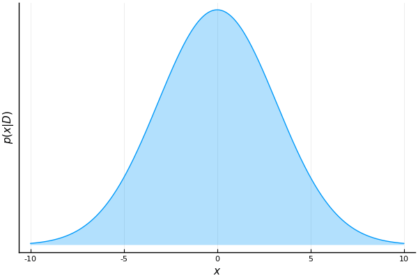

# User guide
This user guide outlines the usage of ForneyLab for solving inference problems. The main content is divided in three parts:
- [Specifying a model](@ref)
- [Generating an algorithm](@ref)
- [Executing an algorithm](@ref)

For installation instructions see the [Getting started](@ref) page. To import ForneyLab into the active Julia session run  

```@example 1
using ForneyLab
```

## Specifying a model
Probabilistic models incorporate the element of randomness to describe an event or phenomenon by using random variables and probability theory. A probabilistic model can be represented diagrammatically by using probabilistic graphical models (PGMs). A factor graph is a type of PGM that is well suited to cast inference tasks in terms of graphical manipulations.

### Creating a new factor graph
In ForneyLab, Factor graphs are represented by a `FactorGraph` type (struct). To instantiate a new (empty) factor graph we use the constructor without arguments
```@example 1
g = FactorGraph();
```

ForneyLab tracks the *active* factor graph. Operations on the graph, such as adding variables or nodes, only affect the active graph. The call to `FactorGraph()` creates a new instance of a factor graph and registers it as the active graph.

To get the active graph run
```@example 1
fg = currentGraph();
```

To set the active graph run
```@example 1
setCurrentGraph(g);
```

### Adding random variables (edges)
Random variables are represented as edges on Forney-style factor graphs. You can add a random variable to the active graph by instantiating a `Variable`. The constructor accepts an `id` of type `Symbol`. For example,
```@example 1
x = Variable(id=:x);
```
associates the variable `x` to an edge of the active graph.

Alternatively, the `@RV` macro achieves the same by a more compact notation. The following line has the same result as the previous one.
```@example 1
@RV x;
```
By default, the `@RV` macro uses the Julia-variable's name to create an `id` for the `Variable` object (`:x` in this example). However, if this `id` was already assigned, then ForneyLab creates a default id of the form `:variable_n`, where `n` is a number that increments. In case you want to provide a custom `id`, the `@RV` macro accepts an optional keyword argument between square brackets. For example,
```@example 1
@RV [id=:my_id] x;
```
adds the variable `x` to the active graph and assigns the `:my_id` symbol to its `id` field. Later we will see that this is useful once we start visualizing the factor graph.

### Adding factor nodes
Factor nodes are used to define a relationship between random variables. A factor node defines a probability distribution over selected random variables. See [Factor nodes](@ref) for a complete list of the available factor nodes in ForneyLab.

We assign a probability distribution to a random variable using the `~` operator together with the `@RV` macro. For example, to create a Gaussian random variable `y`, where its mean and variance are controlled by the random variables `m` and `v` respectively, we define
```@example 1
@RV m
@RV v
@RV y ~ GaussianMeanVariance(m, v);
```

### Visualizing a factor graph
Factor graphs can be visualized using the `draw` function, which takes a `FactorGraph` as argument. Let's visualize the factor graph that we defined in the previous section.
```@example 1
ForneyLab.draw(g)
```

### Clamping
Suppose we know that the variance of the random variable `y`, is fixed to a certain value. ForneyLab provides a `Clamp` node to impose such constraints. Clamp nodes can be implicitly defined by using literals like in the following example
```@example 1
g = FactorGraph() # create a new factor graph
@RV m
@RV y ~ GaussianMeanVariance(m, 1.0)
ForneyLab.draw(g)
```
Here, the literal `1.0` creates a clamp node implicitly. Clamp nodes are visualized with a gray background.

Alternatively, if you want to assign a custom `id` to a `Clamp` factor node, then you have to instantiate them explicitly using its constructor function, i.e.
```@example 1
g = FactorGraph() # create a new factor graph
@RV m
@RV v ~ Clamp(1.0)
@RV y ~ GaussianMeanVariance(m, v)
ForneyLab.draw(g)
```

### Placeholders
Placeholders are `Clamp` factors that act as entry points for data. They associate a given random variable with a buffer through which data is fed at a later point. This buffer has an `id`, a dimensionality and a data type. Placeholders are created with the `placeholder` function. Suppose that we want to feed an array of one-dimensional floating-point data to the `y` random variable of the previous model. We would then need to define `y` as a placeholder as follows.
```@example 1
g = FactorGraph() # create a new factor graph
@RV m
@RV v ~ Clamp(1.0)
@RV y ~ GaussianMeanVariance(m, v)
placeholder(y, :y)
ForneyLab.draw(g)
```
Placeholders default to one-dimensional floating-point data. In case we want to override this with, for example, 3-dimensional integer data, we would need to specify the `dims` and `datatpye` parameters of the `placeholder` function as follows
```julia
placeholder(y, :y, dims=(3,), datatype=Int)
```

In the previous example, we first created the random variable `y` and then marked it as a placeholder. There is, however, a shorthand version to perform these two steps in one. The syntax consists of calling a `placeholder` method that takes an id `Symbol` as argument and returns the new random variable. Here is an example:
```@example 1
x = placeholder(:x);
```
where `x` is now a random variable linked to a placeholder with id `:x`.

In section [Executing an algorithm](@ref) we will see how the data is fed to the placeholders.


### Overloaded operators
ForneyLab supports the use of the `+`, `-` and `*` operators between random variables that have certain types of probability distributions. This is known as *operator overloading*. These operators are represented as deterministic factor nodes in ForneyLab. As an example, a two-component Gaussian mixture can be defined as follows  

```@example 1
g = FactorGraph() # create a new factor graph
@RV x ~ GaussianMeanVariance(0.0, 1.0)
@RV y ~ GaussianMeanVariance(2.0, 3.0)
@RV z = x + y
placeholder(z, :z)
ForneyLab.draw(g)
```

### Online vs. offline learning
Online learning refers to a procedure where observations are processed as soon as they become available. In the context of factor graphs this means that observations need to be fed to the placeholders and processed one at a time. In a Bayesian setting, this reduces to the application of Bayes rule in a recursive fashion, i.e. the posterior distribution for a given random variable, becomes the prior for the next processing step. Since we are feeding one observation at each time step, the factor graph will have *one* placeholder for every observed variable. All of the factor graphs that we have seen so far were specified to process data in this fashion.

Let's take a look at an example in order to contrast it with its offline counterpart. In this simple example, the mean `x` of a Gaussian distributed random variable `y` is modelled by another Gaussian distribution with hyperparameters `m` and `v`. The variance of `y` is assumed to be known.
```@example 1
g = FactorGraph() # create a new factor graph
m = placeholder(:m)
v = placeholder(:v)
@RV x ~ GaussianMeanVariance(m, v)
@RV y ~ GaussianMeanVariance(x, 1.0)
placeholder(y, :y)
ForneyLab.draw(g)
```
As we have seen in previous examples, there is one placeholder linked to the observed variable `y` that accepts one observation at a time. Perhaps what is less obvious is that the hyperparameters `m` and `v` are also defined as placeholders. The reason for this is that we will use them to input our current (prior) belief about `x` for every observation that is processed. In section [Executing an algorithm](@ref) we will elaborate more on this.

Offline learning, on the other hand, involves feeding and processing a batch of `N` observations (typically all available observations) in a single step. This translates into a factor graph that has one placeholder linked to a random variable for *each* sample in the batch. We can specify this type of models using a `for` loop like in the following example.
```@example 1
g = FactorGraph()   # create a new factor graph
N = 3               # number of observations
y = Vector{Variable}(undef, N)
@RV x ~ GaussianMeanVariance(0.0, 1.0)
for i = 1:N
    @RV y[i] ~ GaussianMeanVariance(x, 1.0)
    placeholder(y[i], :y, index=i)
end
ForneyLab.draw(g)
```
The important thing to note here is that we need an extra array of `N` observed random variables where each of them is linked to a dedicated index of the placeholder's buffer. This buffer can be thought of as an `N` dimensional array of `Clamp` factor nodes. We achieve this link by means of the `index` parameter of the `placeholder` function.

In section [Executing an algorithm](@ref) we will see examples of how the data is fed to the placeholders in each of these two scenarios.

## Generating an algorithm
ForneyLab supports code generation for four different types of message-passing algorithms:
- [Belief propagation](https://en.wikipedia.org/wiki/Belief_propagation)
- [Variational message passing](https://en.wikipedia.org/wiki/Variational_message_passing)
- [Expectation maximization](https://en.wikipedia.org/wiki/Expectation-maximization_algorithm)
- [Expectation propagation](https://en.wikipedia.org/wiki/Expectation_propagation)

Whereas belief propagation computes exact inference for the random variables of interest, the variational message passing (VMP), expectation maximization (EM) and expectation propagation (EP) algorithms are approximation methods that can be applied to a larger range of models.

### Belief propagation
The way to instruct ForneyLab to generate a belief propagation algorithm (also known as a sum-product algorithm) is by using the `messagePassingAlgorithm` function. This function takes as argument(s) the random variable(s) for which we want to infer the posterior distribution. As an example, consider the following hierarchical model in which the mean of a Gaussian distribution is represented by another Gaussian distribution whose mean is modelled by another Gaussian distribution.  
```@example 1
g = FactorGraph() # create a new factor graph
@RV m2 ~ GaussianMeanVariance(0.0, 1.0)
@RV m1 ~ GaussianMeanVariance(m2, 1.0)
@RV y ~ GaussianMeanVariance(m1, 1.0)
placeholder(y, :y)
ForneyLab.draw(g)
```
If we were only interested in inferring the posterior distribution of `m1` then we would run
```@example 1
algorithm = messagePassingAlgorithm(m1)
algorithm_code = algorithmSourceCode(algorithm);
```
On the other hand, if we were interested in the posterior distributions of both `m1` and `m2` we would then need to pass them as elements of an array, i.e.
```@example 1
algorithm = messagePassingAlgorithm([m1, m2])
algorithm_code = algorithmSourceCode(algorithm);
```

Note that the message-passing algorithm returned by the `algorithmSourceCode` function is a `String` that contains the definition of a Julia function. In order to access this function, we need to parse the code and evaluate it in the current scope. This can be done as follows
```@example 1
algorithm_expr = Meta.parse(algorithm_code);
```
```julia
:(function step!(data::Dict, marginals::Dict=Dict(), messages::Vector{Message}=Array{Message}(undef, 4))
      #= none:3 =#
      messages[1] = ruleSPGaussianMeanVarianceOutNPP(nothing, Message(Univariate, PointMass, m=0.0), Message(Univariate, PointMass, m=1.0))
      #= none:4 =#
      messages[2] = ruleSPGaussianMeanVarianceOutNGP(nothing, messages[1], Message(Univariate, PointMass, m=1.0))
      #= none:5 =#
      messages[3] = ruleSPGaussianMeanVarianceMPNP(Message(Univariate, PointMass, m=data[:y]), nothing, Message(Univariate, PointMass, m=1.0))
      #= none:6 =#
      messages[4] = ruleSPGaussianMeanVarianceMGNP(messages[3], nothing, Message(Univariate, PointMass, m=1.0))
      #= none:8 =#
      marginals[:m1] = (messages[2]).dist * (messages[3]).dist
      #= none:9 =#
      marginals[:m2] = (messages[1]).dist * (messages[4]).dist
      #= none:11 =#
      return marginals
  end)
```

```@example 1
eval(algorithm_expr)
```

At this point a new function named `step!` becomes available in the current scope. This function contains a message-passing algorithm that infers both `m1` and `m2` given one or more `y` observations. In the section [Executing an algorithm](@ref) we will see how this function is used.

### Variational message passing
Variational message passing (VMP) algorithms are generated much in the same way as the belief propagation algorithm we saw in the previous section. There is a major difference though: for VMP algorithm generation we need to define the factorization properties of our approximate distribution. A common approach is to assume that all random variables of the model factorize with respect to each other. This is known as the *mean field* assumption. In ForneyLab, the specification of such factorization properties is defined using the `PosteriorFactorization` composite type. Let's take a look at a simple example to see how it is used. In this model we want to learn the mean and variance of a Gaussian distribution, where the former is modelled with a Gaussian distribution and the latter with a Gamma.
```@example 1
g = FactorGraph() # create a new factor graph
@RV m ~ GaussianMeanVariance(0, 10)
@RV w ~ Gamma(0.1, 0.1)
@RV y ~ GaussianMeanPrecision(m, w)
placeholder(y, :y)
draw(g)
```
The construct of the `PosteriorFactorization` composite type takes the random variables of interest as arguments and one final argument consisting of an array of symbols used to identify each of these random variables. Here is an example of how to use this construct for the previous model where we want to infer `m` and `w`.
```@example 1
q = PosteriorFactorization(m, w, ids=[:M, :W]);
```
Here, the `PosteriorFactorization` constructor specifies a posterior factorization. We can view the posterior factorization as dividing the factor graph into several subgraphs, each corresponding to a separate factor in the posterior factorization. Minimization of the free energy is performed by iterating over each subgraph in order to update the posterior marginal corresponding to the current factor which depends on messages coming from the other subgraphs. This iteration is repeated until either the free energy converges to a certain value or the posterior marginals of each factor stop changing. We can use the `ids` passed to the `PosteriorFactorization` constructor to visualize the corresponding subgraphs, as shown below.   
```@example 1
ForneyLab.draw(q.posterior_factors[:M])
```
```@example 1
ForneyLab.draw(q.posterior_factors[:W])
```
Generating the VMP algorithm then follows a similar same procedure as the belief propagation algorithm. In the VMP case however, the resulting algorithm will consist of multiple step functions, one for each posterior factor, that need to be executed iteratively until convergence.
```@example 1
# Construct and compile a variational message passing algorithm
algo = messagePassingAlgorithm()
algo_code = algorithmSourceCode(algo)
eval(Meta.parse(algo_code));
```
```julia
Meta.parse(algo) = quote
    #= none:3 =#
    function stepM!(data::Dict, marginals::Dict=Dict(), messages::Vector{Message}=Array{Message}(undef, 2))
        #= none:5 =#
        messages[1] = ruleVBGaussianMeanVarianceOut(nothing, ProbabilityDistribution(Univariate, PointMass, m=0), ProbabilityDistribution(Univariate, PointMass, m=10))
        #= none:6 =#
        messages[2] = ruleVBGaussianMeanPrecisionM(ProbabilityDistribution(Univariate, PointMass, m=data[:y]), nothing, marginals[:w])
        #= none:8 =#
        marginals[:m] = (messages[1]).dist * (messages[2]).dist
        #= none:10 =#
        return marginals
    end
    #= none:14 =#
    function stepW!(data::Dict, marginals::Dict=Dict(), messages::Vector{Message}=Array{Message}(undef, 2))
        #= none:16 =#
        messages[1] = ruleVBGammaOut(nothing, ProbabilityDistribution(Univariate, PointMass, m=0.1), ProbabilityDistribution(Univariate, PointMass, m=0.1))
        #= none:17 =#
        messages[2] = ruleVBGaussianMeanPrecisionW(ProbabilityDistribution(Univariate, PointMass, m=data[:y]), marginals[:m], nothing)
        #= none:19 =#
        marginals[:w] = (messages[1]).dist * (messages[2]).dist
        #= none:21 =#
        return marginals
    end
end
```

#### Computing free energy
VMP inference boils down to finding the member of a family of tractable probability distributions that is closest in KL divergence to an intractable posterior distribution. This is achieved by minimizing a quantity known as *free energy*. ForneyLab offers to optionally compile code for evaluating the free energy. Free energy is particularly useful to test for convergence of the VMP iterative procedure.
```julia
algo = messagePassingAlgorithm(free_energy=true)
algo_code = algorithmSourceCode(algo, free_energy=true)
eval(Meta.parse(algo_code))
```

### Expectation maximization

The expectation step of the expectation maximization (EM) algorithm can be executed by sum-product message passing, while the maximization step can be performed analytically or numerically. 
```@example 1
g = FactorGraph()
v = placeholder(:v) # parameter of interest
@RV m ~ GaussianMeanVariance(0.0, 1.0)
@RV y ~ GaussianMeanVariance(m, v)
placeholder(y, :y);
```
Generating a sum-product algorithm towards a clamped variable signals ForneyLab that the user wishes to optimize this parameter. Next to returning a `step!()` function, ForneyLab will then provide mockup code for an `optimize!()` function as well.
```@example 1
algo = messagePassingAlgorithm(v);
```
```julia
# You have created an algorithm that requires updates for (a) clamped parameter(s).
# This algorithm requires the definition of a custom `optimize!` function that updates the parameter value(s)
# by altering the `data` dictionary in-place. The custom `optimize!` function may be based on the mockup below:

# function optimize!(data::Dict, marginals::Dict=Dict(), messages::Vector{Message}=init())
#   ...
#   return data
# end
```
This `optimize!()` function accepts This function needs to be defined by the user and may optionally depend upon external tools. Note that `optimize!()` and `step!()` functions have the same calling signature. However, where a `step!()` function accepts the `data` and updates the `messages` and `marginals`, the `optimize!()` function operates vice-versa. Iterating these functions offers a general mechanism for implementing EM-type algorithms. See the demos for a detailed example.


## Executing an algorithm
In section [Specifying a model](@ref) we introduced two main ways to learn from data, namely in an online and in an offline setting. We saw that the structure of the factor graph is different in each of these settings. In this section we will demonstrate how to feed data to an algorithm in both an online and an offline setting. We will use the same examples from section [Online vs. offline learning](@ref).

### Online learning
For convenience, let's reproduce the model specification for the problem of estimating the mean `x` of a Gaussian distributed random variable `y`, where `x` is modelled using another Gaussian distribution with hyperparameters `m` and `v`. Let's also generate a belief propagation algorithm for this inference problem like we have seen before.
```@example 1
g = FactorGraph() # create a new factor graph
m = placeholder(:m)
v = placeholder(:v)
@RV x ~ GaussianMeanVariance(m, v)
@RV y ~ GaussianMeanVariance(x, 1.0)
placeholder(y, :y)

algo = messagePassingAlgorithm(x)
eval(Meta.parse(algorithmSourceCode(algo))); # generate, parse and evaluate the algorithm
```
In order to execute this algorithm we first have to specify a prior for `x`. This is done by choosing some initial values for the hyperparameters `m` and `v`. In each processing step, the algorithm expects an observation and the current belief about `x`, i.e. the prior. We pass this information as elements of a `data` dictionary where the keys are the `id`s of their corresponding placeholders. The algorithm performs inference and returns the results inside a different dictionary (which we call `marginals` in the following script). In the next iteration, we repeat this process by feeding the algorithm with the next observation in the sequence and the posterior distribution of `x` that we obtained in the previous processing step. In other words, the current posterior becomes the prior for the next processing step. Let's illustrate this using an example where we will first generate a synthetic dataset by sampling observations from a Gaussian distribution that has a mean of 5.
```@example 1
using Plots, LaTeXStrings; theme(:default) ;
pyplot(fillalpha=0.3, leg=false, xlabel=L"x", ylabel=L"p(x|D)", yticks=nothing)

N = 50                      # number of samples
dataset = randn(N) .+ 5     # sample N observations from a Gaussian with m=5 and v=1

normal(μ, σ²) = x -> (1/(sqrt(2π*σ²))) * exp(-(x - μ)^2 / (2*σ²)) # to plot results

m_prior = 0.0   # initialize hyperparameter m
v_prior = 10    # initialize hyperparameter v

marginals = Dict()  # this is where the algorithm stores the results

anim = @animate for i in 1:N
    data = Dict(:y => dataset[i],
                :m => m_prior,
                :v => v_prior)

    plot(-10:0.01:10, normal(m_prior, v_prior), fill=true)

    step!(data, marginals) # feed in prior and data points 1 at a time

    global m_prior = mean(marginals[:x]) # today's posterior is tomorrow's prior
    global v_prior = var(marginals[:x])  # today's posterior is tomorrow's prior
end
;
```


As we process more samples, our belief about the possible values of `m` becomes more confident.

### Offline learning
Executing an algorithm in an offline fashion is much simpler than in the online case. Let's reproduce the model specification of the previous example in an offline setting (also shown in [Online vs. offline learning](@ref).)
```@example 1
g = FactorGraph()   # create a new factor graph
N = 30              # number of observations
y = Vector{Variable}(undef, N)
@RV x ~ GaussianMeanVariance(0.0, 1.0)
for i = 1:N
    @RV y[i] ~ GaussianMeanVariance(x, 1.0)
    placeholder(y[i], :y, index=i)
end

algo = messagePassingAlgorithm(x)
eval(Meta.parse(algorithmSourceCode(algo))); # generate, parse and evaluate the algorithm
```
Since we have a placeholder linked to each observation in the sequence, we can process the complete dataset in one step. To do so, we first need to create a dictionary having the complete dataset array as its single element. We then need to pass this dictionary to the `step!` function which, in contrast with the online counterpart, we only need to call once.
```@example 1
data = Dict(:y => dataset)
marginals = step!(data) # Run the algorithm
plot(-10:0.01:10, normal(mean(marginals[:x]), var(marginals[:x])), fill=true)
```

!!! note
    ForneyLab is aimed at processing time-series data; batch processing does not perform well with large datasets at the moment. We are working on this issue.
